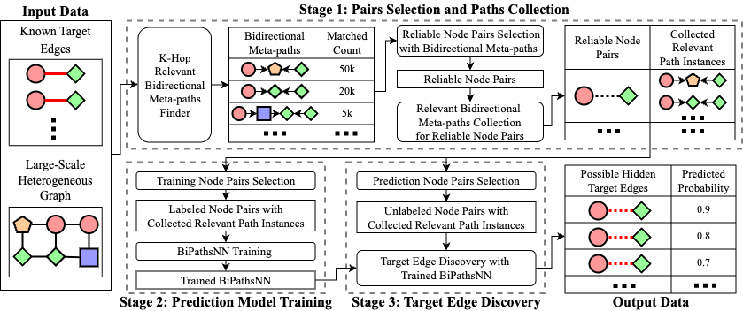
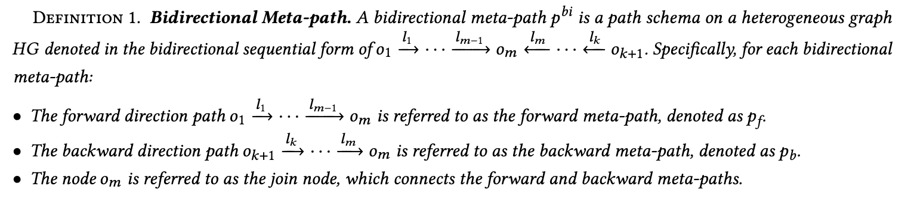
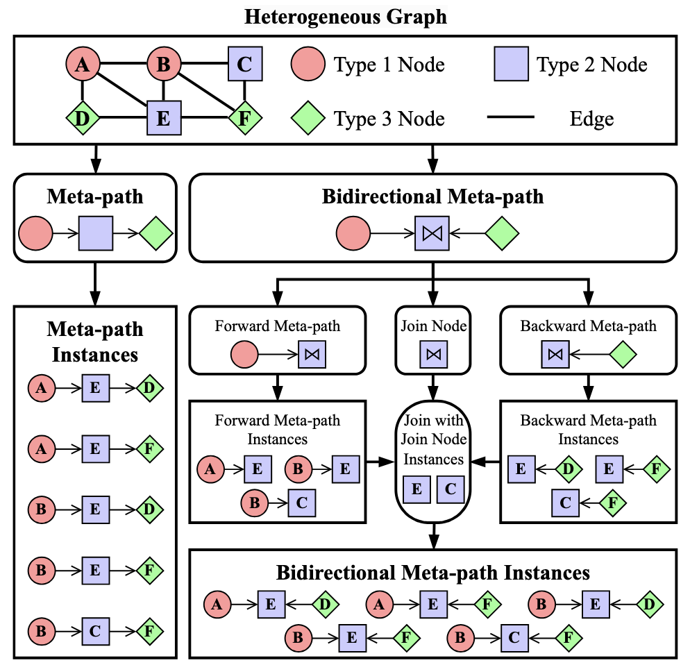
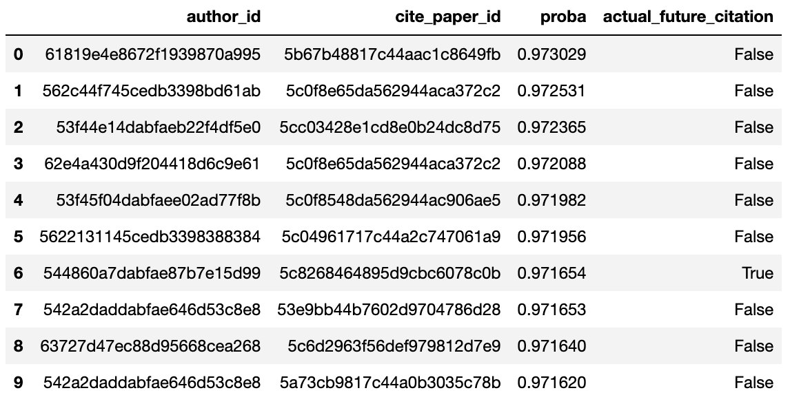
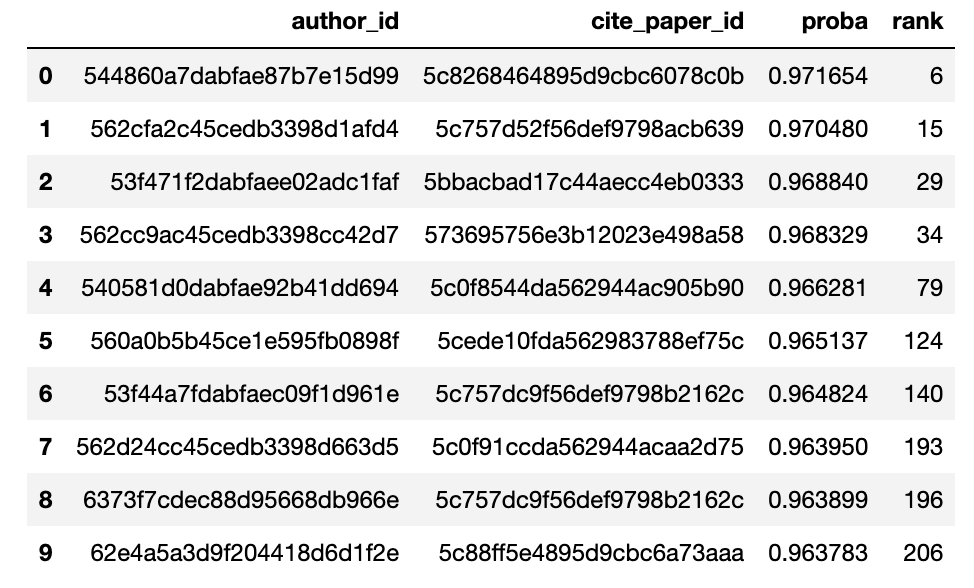

# BiPaths2Link

This is the code for BiPaths2Link, a bidirectional meta-path based efficient link discovery framework for large-scale distributed heterogeneous graphs. Its design is based on our paper "BiPaths2Link: Bidirectional Meta-paths for Efficient Link Discovery in Large-Scale Distributed Heterogeneous Graphs" (currently under review).

# Overview

The framework contains an implementation of bidirectional meta-path search optimized for distributed systems and a model named Bidirectional Meta-paths Neural Network (BiPathsNN) that can directly leverage search results for effective link prediction.

The workflow of BiPaths2Link has three main stages:

<p align="center">

</p>
<div align="center">Three-stage workflow of the BiPaths2Link framework.</div>
<br>

1. **Stage 1:** We use the bidirectional meta-path search to find meta-paths relevant to known target edges, select reliable node pairs, and collect all the relevant path instances between these node pairs. 

2. **Stage 2:** We select reliable node pairs that can be labeled with known target edges and train our BiPathsNN model based on these labeled node pairs and their corresponding path instances. 

3. **Stage 3:** We select all reliable node pairs without known target edges and use the trained BiPathsNN model to discover the most likely hidden target edges.

# Bidirectional Meta-Path
The key design of our framework is based on a definition called "Bidirectional Meta-path", which describes all bidirectional search results with a unified data structure. This enables efficient implementation of bidirectional meta-path search in distributed systems and allows direct use of search results for link prediction.

<p align="center">

</p>

Below is an example comparing traditional meta-paths with our bidirectional meta-paths:

<p align="center">

</p>
<div align="center">Example of meta-path and bidirectional meta-path.</div>
<br>

# Real-world Link Discovery Performance
We evaluated the performance of BiPaths2Link on two real-world link discovery tasks.

## Authors' Future Citation Papers Discovery
We predicted papers that authors would cite in 2020-2021 based on data before 2020. The raw data comes from [AMiner](https://originalfileserver.aminer.cn/misc/dblp_v14.tar.gz) dataset. BiPaths2Link selected 1.1 billion reliable authors' future citation relations and ranked them using the existence probabilities predicted by BiPathsNN. Among 133,672 ground-truth future citations, 13,203 (9.88%) were ranked within the top 0.1%, demonstrating BiPaths2Link's ability to accurately discover future citations at scale.

The top 1 million predicted future citations are available in [./example_results/real_author_citation_rank.csv](./example_results/real_author_citation_rank.csv):

<p align="center">

</p>
<div align="center">Column 'actual_future_citation' = True indicates an actual future citation.</div>
<br>

The rankings of all 133,672 ground-truth future citations among the 1.1 billion candidate pairs are available in [./example_results/pred_top_1_million_author_citation.csv](./example_results/pred_top_1_million_author_citation.csv):

<p align="center">

</p>

## Companies' Key Person Discovery
We deployed BiPaths2Link to discover companies' key personnel for real-world customer expansion. When contacting the key personnel discovered by BiPaths2Link, our success rates improved by 78.6\%. 

# Code Structure
```
BiPaths2Link/
│
├── data_prepare/            # Code for data preprocessing
│   └── AMiner/              # Code for preprocessing AMiner dataset
│
├── joinminer/               # Core components
│   ├── dataset/             # Code for transforming tabular data into matrix format for BiPathsNN
│   ├── engine/              # Code for distributed training and prediction of BiPathsNN
│   ├── graph/               # Code for building heterogeneous graphs in tabular form
│   ├── hdfs/                # Code for HDFS-related operations
│   ├── model/               # PyTorch implementation of BiPathsNN
│   ├── pyspark/             # Code for Spark-related operations
│   └── python/              # Code for Python utilities (e.g., decorators)
│
├── main/                    # Implementation of BiPaths2Link
│   ├── config/              # Configuration files for BiPaths2Link
│   ├── link_level/
│   │   └── new_cite_paper/  # Implementation for authors' future citation papers discovery
```

# Data Structure

Examples of the five table formats used in this framework can be found in:

1. Node table: [./example_results/node_table.csv](./example_results/node_table.csv)
2. Edge table: [./example_results/edge_table.csv](./example_results/edge_table.csv)
3. Known target edge table: [./example_results/known_target_edge_table.csv](./example_results/known_target_edge_table.csv)
4. Path table: [./example_results/path_table.csv](./example_results/path_table.csv)
5. Pair table: [./example_results/pair_table.csv](./example_results/pair_table.csv)

# Requirements
```
pyspark==3.0.2
pytorch==2.4.0
```
